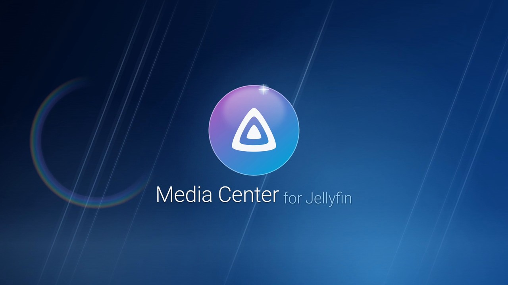
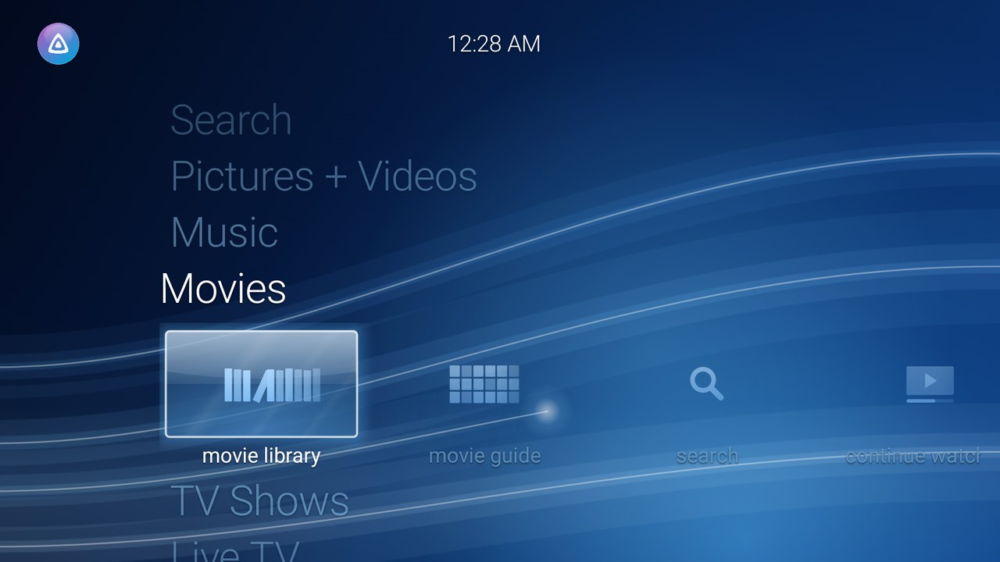
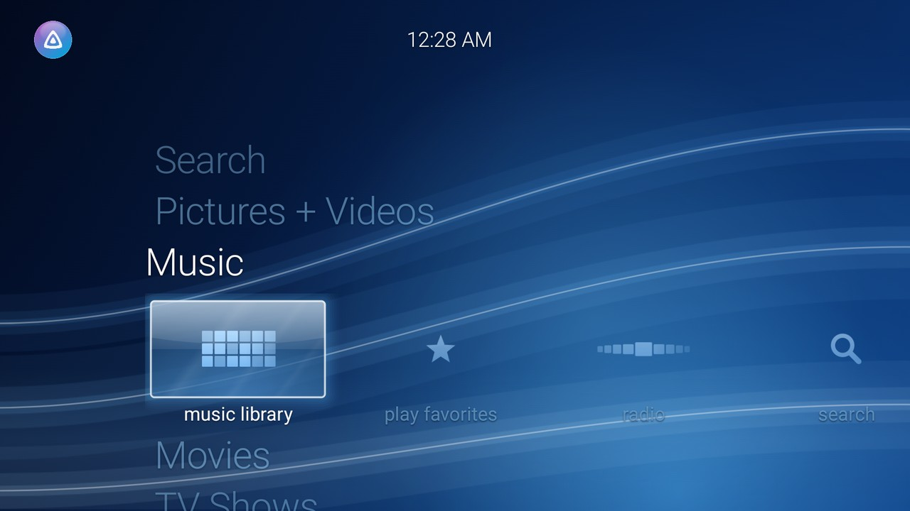
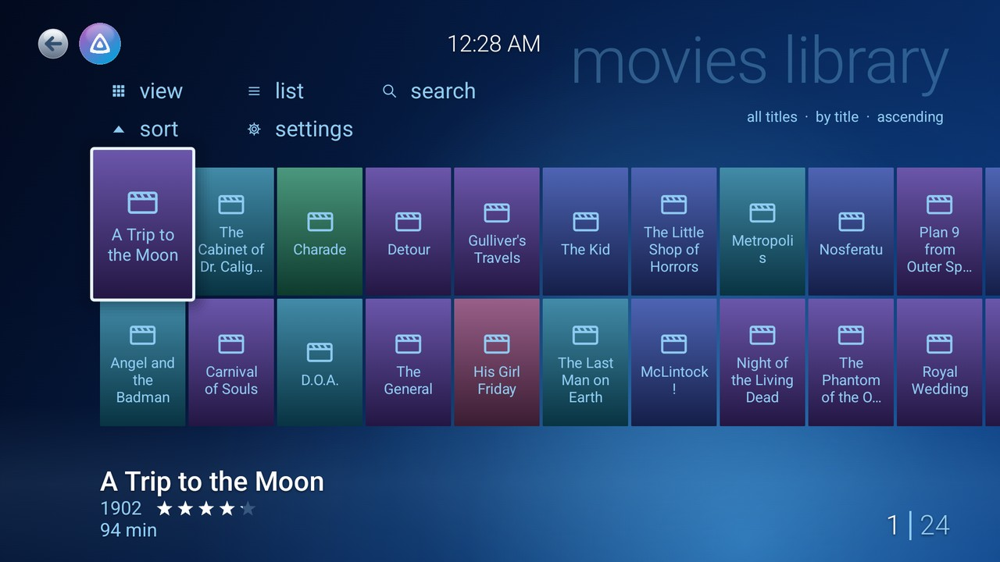
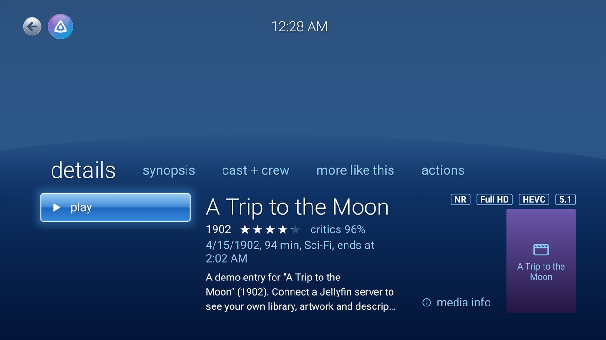
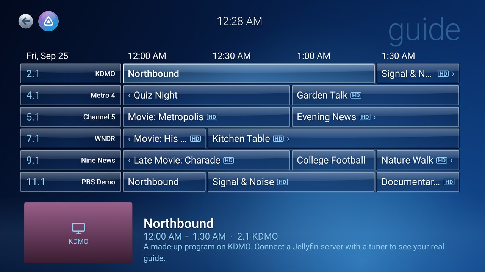
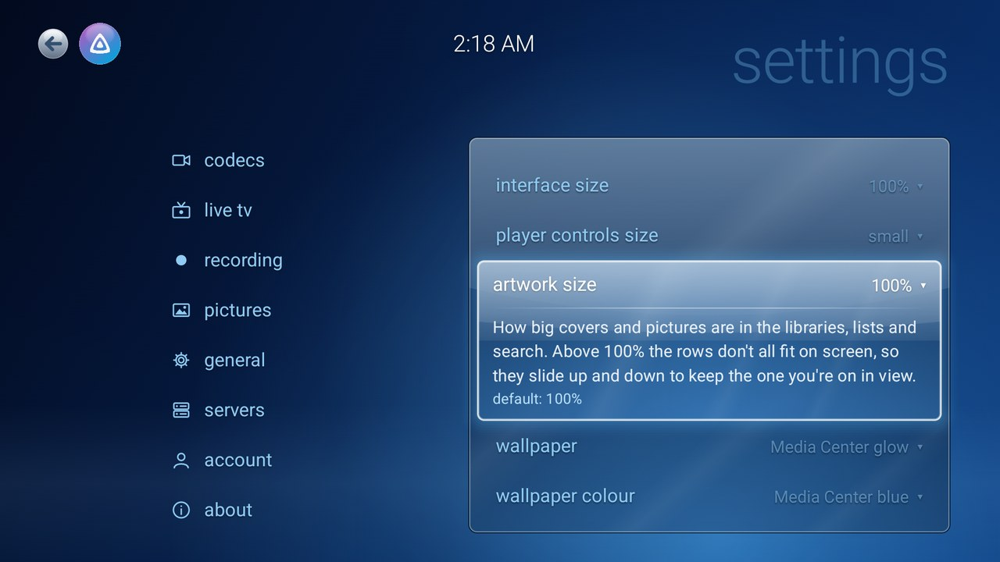
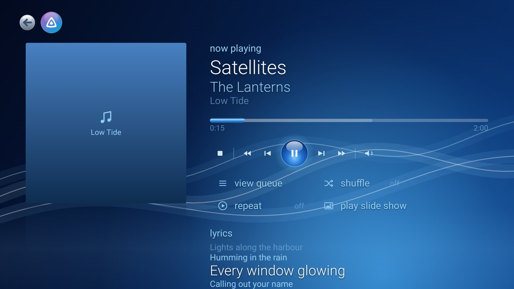
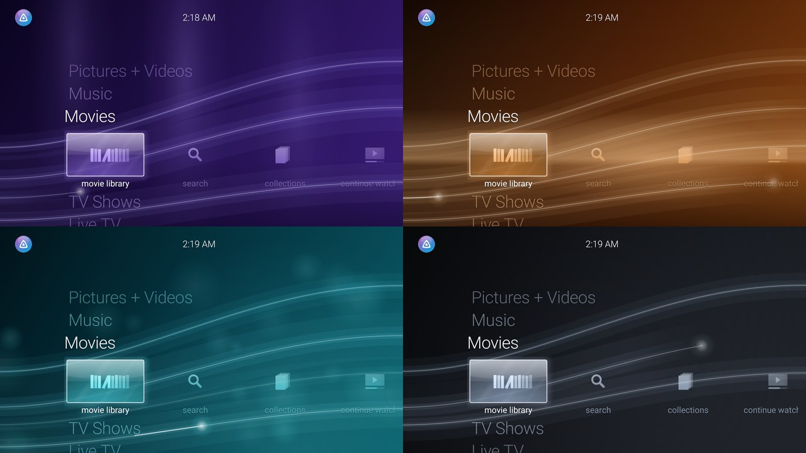

# Media Center for Jellyfin

An Android TV client for [Jellyfin](https://jellyfin.org) that looks, sounds and behaves like
Windows 7 Media Center: the startup animation, the vertical start menu with its strips of tiles,
glass and glow, pivot-driven galleries, the transport strip over video, and soft interface sounds.
It plays almost anything as-is, and is built to stay smooth on small TV boxes with 2 GB of memory.



| | |
|---|---|
|  |  |
|  |  |
|  |  |
|  |  |

*Screenshots are from the built-in demo library.*

## Features

- **Media Center's start menu:** Pictures + Videos, Music, Movies, TV Shows, Live TV and Tasks,
  with the tiles in Media Center's order and in its style (a mosaic for music and pictures, a
  shelf of cases for movies, a strip for TV), and search on each row. Rows only appear for what
  your server has.
- **Hold OK for options** on anything: play, shuffle, add to queue, play next, more info, watched,
  favorites, record.
- **Movie and TV libraries** with My Movies' views, sorting and lists (watched, favorites,
  continue watching, next up, years, parental ratings, genres, and video type from SD to 4K,
  3D, DVD, Blu-ray and ISO), on every Movies and TV Shows tile.
- **Galleries** with pivots (title, genre, year, date added, unwatched, favorites), covers that
  lift on focus, series and album pages, people, collections and search.
- **Playback that avoids conversion:** the TV's own hardware decoders first, plus an FFmpeg
  decoder for DTS, TrueHD and the like; Dolby Digital, Dolby Digital Plus, DTS, TrueHD and Atmos
  passed through to a receiver; HDR and Dolby Vision where the TV supports them;
  high-resolution audio. When something can't play as-is, it steps down gently: different
  output settings first, then the server converting only the sound, then a full conversion.
- **Optimize for this TV:** checks the screen, decoders, sound output, connection and memory,
  and sets quality, resolution and audio to suit.
- **The remote, as in Media Center:** with the controls hidden, OK pauses, Left replays 7 s and
  Right skips 30 s (with preview thumbnails where the server has them). Each can be turned off.
- **In the player:** match frame rate, chapters, styled (ASS/SSA) subtitles, sound and subtitle
  sync, speed, night mode, a quick info bar, and your soundtrack and subtitle choices remembered
  per show.
- **Skip intros, credits, adverts and recaps** (Jellyfin media segments; Back puts a skip button
  away), Up Next in an episode's last seconds (you choose how many), sleep timer, subtitles (text
  and picture-based), audio and subtitle language preferences.
- **Find subtitles online** from the player's subtitle menu, when a video has none or not in your
  language (needs a subtitle plugin on the server, such as OpenSubtitles).
- **Live TV:** channel guide, Media Center's mini guide over the picture, now-playing banner,
  movie guide, recordings and scheduling.
- **Music:** now playing with a visualizer and lyrics, a queue, radio and favorites.
- **Pictures:** slide shows with pan and zoom, transitions, captions and music.
- **Screensaver** with your server's artwork, which leaves music and paused videos alone; it can
  be the TV's own screensaver too.
- **Voice search**, and "search Media Center for…" from the Assistant.
- **Updates itself** from GitHub releases, once you confirm.
- **Wallpapers and sizes:** five wallpaper patterns in eight colours (menus and highlights follow
  the colour), and separate sizes for text (85–140%), the interface (80–130%), artwork
  (85–125%) and the player controls.
- **Servers:** finds Jellyfin servers on your network, keeps several servers and users, signs in
  with a password or Quick Connect. Switching back to someone opens their menus at once from a
  compressed copy, then catches up with the server.
- **Close:** minimize (back to the TV's home, the app kept as it is) or shut down (closes
  completely).
- **Video behind the menus:** leave the player and the video keeps playing, dimmed, behind the
  menus; music plays on in a corner inset.
- **Server plugin (optional):** with the [Media Center plugin](plugin/README.md) on your Jellyfin
  server, an administrator can set and lock the app's settings (for everyone or per user), show
  notices, announce updates, and brand the app with their own chime, sounds, logo, intro title,
  backdrop and accent colour.

Needs Android 6.0 or later (Android TV and Google TV) and a Jellyfin server (the skip buttons
need Jellyfin 10.10 or later). **Try the demo** on the sign-in screen browses a sample library without a server.

## Install

Download the APK from the newest [release](https://github.com/madmaxx636/MediaCenter-Jellyfin/releases):

| File | For |
|---|---|
| `…-arm32.apk` | Almost every TV and TV box (onn, Chromecast with Google TV, Fire TV, most smart TVs) |
| `…-arm64.apk` | 64-bit devices such as the Nvidia Shield |
| `…-universal.apk` | Any device, if you're not sure (larger) |

Install it with a downloader app on the TV, or from a computer with network (wireless) debugging
turned on in the TV's developer options, using the address and port it shows:

```bash
adb connect <tv-ip>:<port>
adb install -r MediaCenter-for-Jellyfin-1.0.0-arm32.apk
```

After that, the app keeps itself up to date: it offers new versions on the start menu (and in
settings › about) and installs them once you confirm. The first time, Android may ask you to
allow Media Center to install apps.

## Build

Needs JDK 17 or later (Android Studio's bundled JBR works) and the Android SDK.

```bash
./gradlew assembleDebug          # a debug build
./gradlew assembleRelease        # release APKs, one per ABI plus a universal one
```

Release builds are signed with the key described in `signing/keystore.properties` (not in the
repository; `storeFile`, `storePassword`, `keyAlias`, `keyPassword`); without it they fall back
to the debug key.

### Sounds

The interface sounds are the app's own, rendered by `tools/make_sounds.py`
(`python3 tools/make_sounds.py app/src/main/res/raw`; needs numpy and ffmpeg). For your own
builds you can use other sounds by putting `custom_focus`, `custom_select`, `custom_back`,
`custom_error` or `custom_intro` (`.ogg`) in `app/src/localres/raw/`, which is ignored by git.
Builds for sharing should leave them out: `./gradlew assembleRelease -Ppublic`.

## Layout

| Path | What |
|---|---|
| `data/` | Jellyfin API client, repository, settings, saved servers and the offline demo |
| `playback/` | ExoPlayer set-up and fallbacks, device codec detection, auto-tuning, stereo downmix |
| `ui/theme/` | Palette, type, backdrop and ribbons |
| `ui/components/` | Focus, glass, controls, glyphs and tile art |
| `ui/screens/` | Start menu, galleries, details, player, guide, photos, settings, sign-in, intros |
| `tools/` | Sound and banner generators |
| `plugin/` | The Jellyfin server plugin (C#, .NET 10) |

## License and credits

Media Center for Jellyfin is free software under the [GNU General Public License, version 3](LICENSE).

- The Jellyfin logo is © Jellyfin contributors, licensed under
  [CC BY-SA 4.0](https://creativecommons.org/licenses/by-sa/4.0/); the orb artwork made from it
  is shared under the same license.
- Built with [AndroidX Media3](https://github.com/androidx/media), Jetpack Compose,
  [Ktor](https://ktor.io) and [Coil](https://coil-kt.github.io/coil/) (Apache 2.0),
  [Jellyfin's FFmpeg decoder for Media3](https://github.com/jellyfin/jellyfin-androidx-media) and
  [NextLib](https://github.com/anilbeesetti/nextlib) (GPL 3.0), and
  [libass-android](https://github.com/peerless2012/libass-android) (MIT).
- The screensaver follows the one in [Wholphin](https://github.com/damontecres/Wholphin).

This project isn't affiliated with or endorsed by Microsoft or the Jellyfin project. Windows and
Windows Media Center are trademarks of Microsoft. No Microsoft artwork, fonts or sounds are included.
